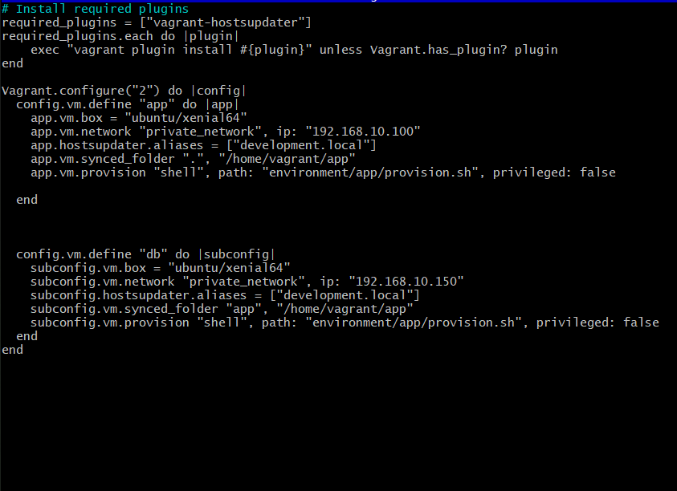
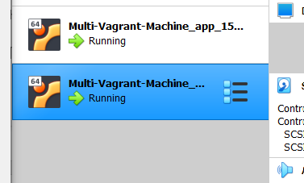
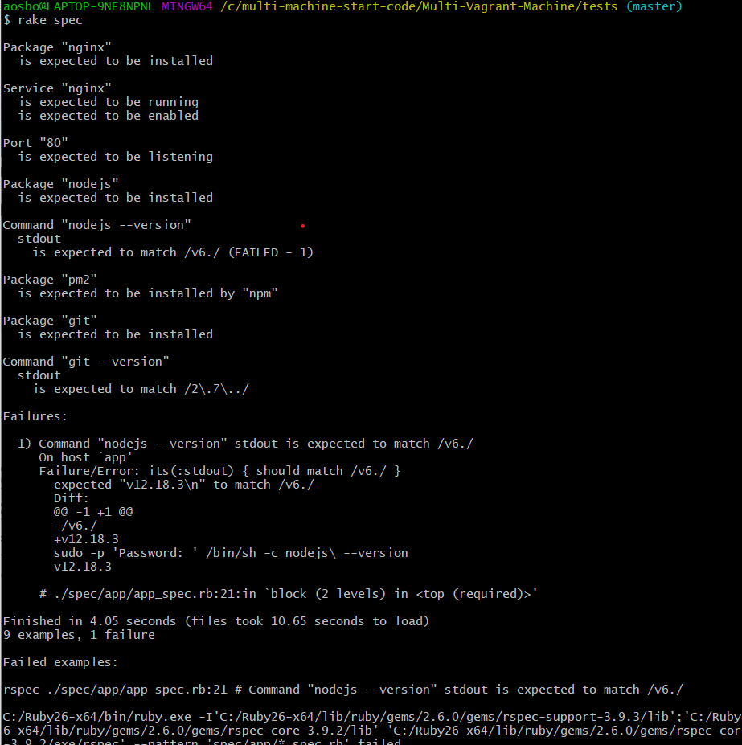

## Creating a Multi Vagrant Machine with Linux

- First the vagrant file had to be updated, using nano vagrant file to enter



- Here make another block of code for the second virtual machine, this VM will be called
"db"

After having changed the Vagrant file, when you run 'vagrant up' two VMs will be created one after another


Then carry out a rack test to see whether the dependencies are downloaded..
This is done by locating yourself to the tests directory and running rake spec




AS the node failed, we will make our way to the provisions directory and add a command.
# 12 has been changed to v6
curl -sL https://deb.nodesource.com/setup_6.x | sudo -E bash -

This command will update node after we have installed it and thus rake spec should then pass.


Now that the two VM's have been created, we will update the provision.sh, adding the code necessary.

```buildoutcfg

```


