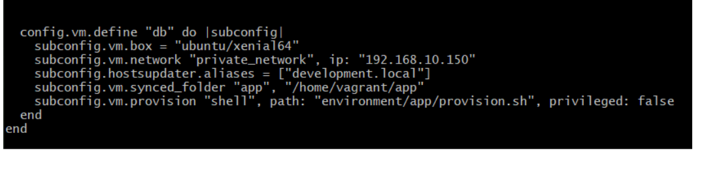

## Creating a Multi Vagrant Machine with Linux

### Aims of this activity

1) Create a second virtual machine within our vagrant file named "db"

2) Configure the db machine with a different IP address from the app

3) Provision the db with a MongoDB database

Additionally we can run the test sets to make sure the machines were created
correctly

## Task 1

- To create a second VM, we must enter the vagrant file in which the first VM has
already been created.

- Once here, we can add the configurations necessary to create the VM



## Task 2

- Where we configure the vm network, we have changed the ip address
for our database Virtual Machine


- Here make another block of code for the second virtual machine, this VM will be called
"db"

After having changed the Vagrant file, when you run 'vagrant up' two VMs will be created one after another


Then carry out a rack test to see whether the dependencies are downloaded..
This is done by locating yourself to the tests directory and running rake spec


All the tests passed, except the node.js. Looking at the provisions directory we can see that
one of the commands has version 12 instead of 6. After making these changes all the tests pass
AS the node failed, we will make our way to the provisions directory and add a command.
# 12 has been changed to v6
curl -sL https://deb.nodesource.com/setup_6.x | sudo -E bash -

Now we can update the provision.sh file and add in the commands to connect to the mongo DB database
Now that the two VM's have been created, we will update the provision.sh, adding the code necessary.

```buildoutcfg

```


