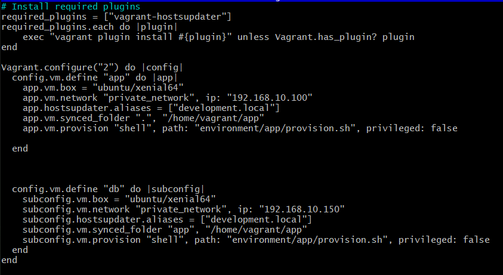

## Creating a Multi Vagrant Machine with Linux

- First the vagrant file had to be updated, using nano vagrant file to enter

- Here make another block of code for the second virtual machine, this VM will be called
"db"

After having changed the Vagrant file, when you run 'vagrant up' two VMs will be created one after another

Then carry out a rack test to see whether the dependencies are downloaded..
This is done by locating yourself to the tests directory and running rake spec

