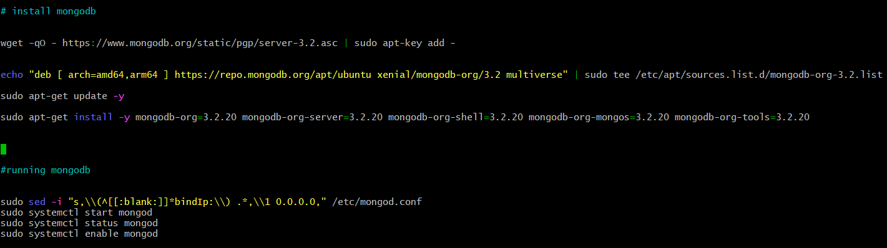

# Creating a Multi Vagrant Machine with Linux :computer: :computer:

## Aims of this activity :books:

### 1) [Create a second virtual machine within our vagrant file with the name "db"](#Task-1)

### 2) [Configure the db machine with a different IP address from the current app virtual machine](#Task-2)

### 3) [Provision the db with a MongoDB database](#Task-3)

### 4) [Task Review](#Task-Review)


## Task 1

- Once inside the folder named "multi-machine-start-code", navigate into the folder containing the
Vagrant file

- To create a second VM, we must enter this vagrant file with the command ``` nano Vagrantfile``` in which the first 
VM has already been created.

- Once here, we can add the configurations necessary to create the VM


## Task 2

- Where we configure the VM network, we have changed the ip address
for our database Virtual Machine, this means they can be hosted on separate ports


- Before running anything on our VMs, we want to relocate to the folder where our provisions.sh
file is located, using the path

```
.../Multi-Vagrant-Machine/environment/app
```

- Once here we will run ``` chmod +x provision.sh ```, this command will make the file executable and so
it will run when we turn on our Virtual Machines.

- Now that our provisions file is executable , we want to check that the existing code that we have is working correctly.
- From the same directory as the vagrant file we run vagrant up, due to our changes if all goes to plan
after the VM named "app" is created, "db" should also be created afterwards

- We can then change directory into our tests folder and run the command ``` rake spec ```. By doing this we will know whether
our VMs are working as they should.


## Task 3

- To be able to connect our VM to the MongoDB server using bash scripts we must update the contents within our 
provision.sh file.

- Initial attempts were not so successful and this highlights the importance of using the tests

- After implementing TTD to work towards fixing the issues, this code within the provision.sh
 will be used to allow a connection to MongoDB




- We will now be able to run the tests with zero failures on both Virtual Machines


## Task Review :white_check_mark:

- One of the main principles of DevOps is automation and efficient development. This task has shown how they have been implemented.

- This task has shown the importance of using bash scripts. Writing all the commands in one provisions file that is executed
once the vagrant is turned on means that these commands do not have to be written one by one in the terminal.

- In addition to this, we have seen the importance of running tests after each iteration. If we see an error we can make
the amendments necessary to make sure all the dependencies for the app are available.


